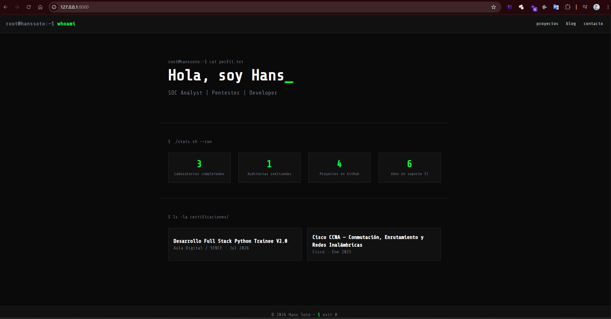
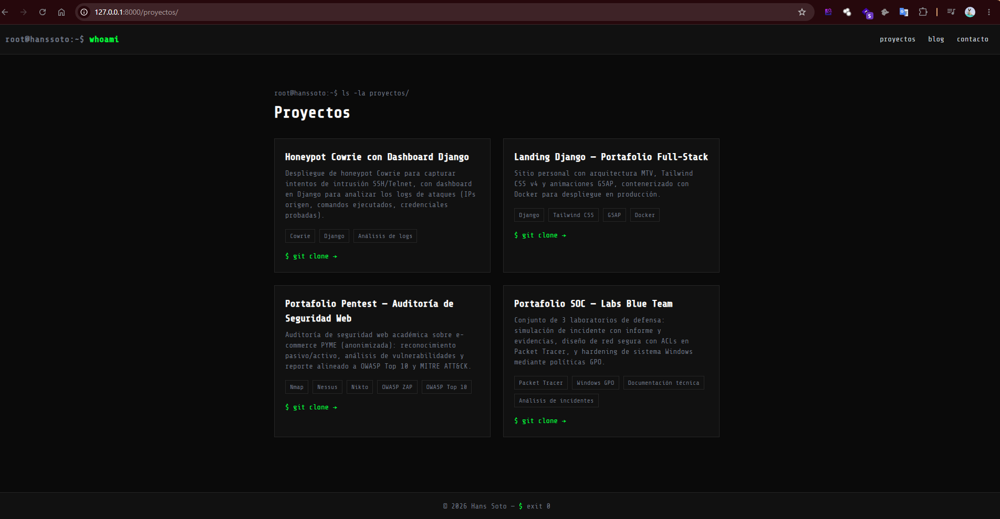
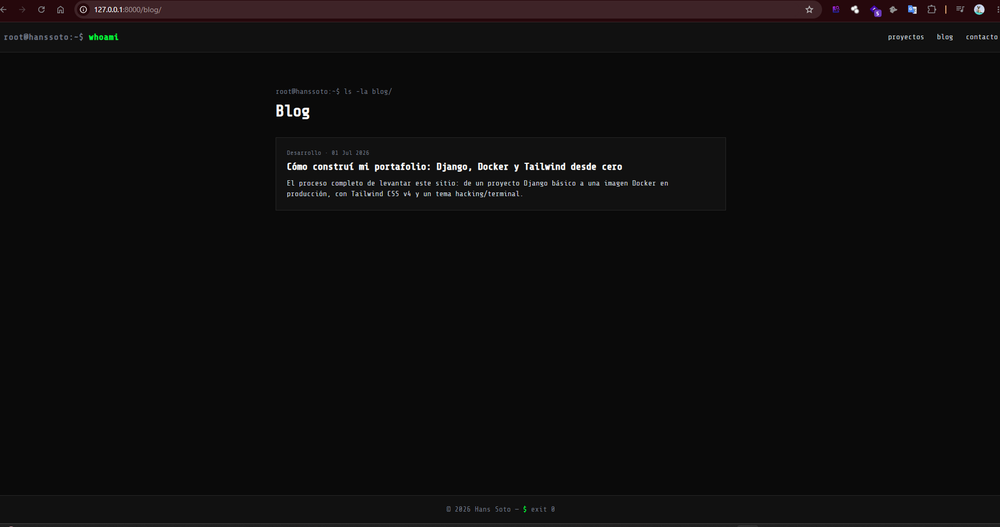
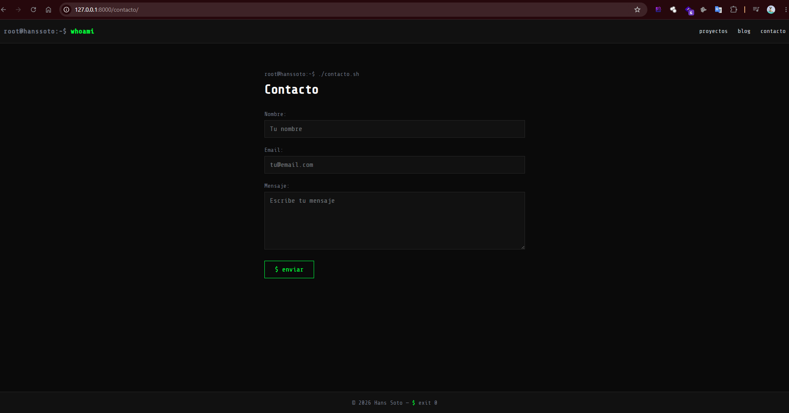
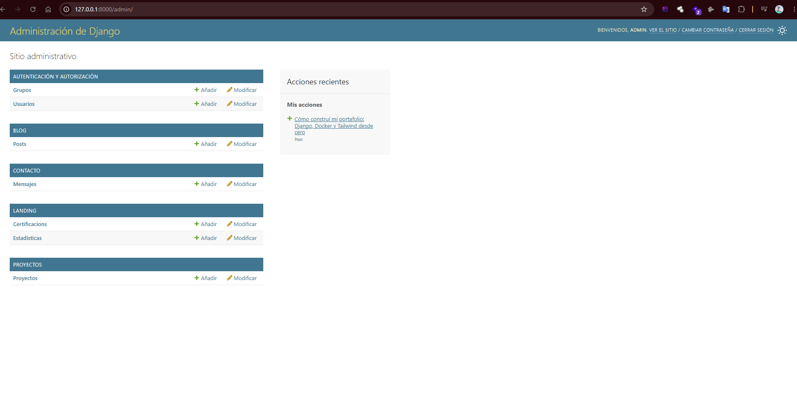

# Landing Django — hanssoto

Portafolio personal desarrollado en Django, con estilo hacking/Kali (dark + monospace + acentos verde terminal), Tailwind CSS v4 y animaciones GSAP.

## 🚀 Stack

- Python 3.13 + Django 6.0
- SQLite (desarrollo)
- Tailwind CSS v4 (build local con CLI)
- GSAP (animaciones: typewriter, scroll reveal, contador)
- Gunicorn + WhiteNoise (producción)
- Docker + Docker Compose

## 📁 Estructura del proyecto
landing-django/
├── config/            # settings, urls raíz
├── landing/           # home, certificaciones, estadísticas
├── proyectos/         # modelo Proyecto + listado
├── blog/              # modelo Post + listado/detalle
├── contacto/          # formulario de contacto
├── templates/         # base.html + partials/ + templates por app
├── static/            # css/js compilados (servidos)
├── tailwind_src/      # input.css fuente de Tailwind (no se sirve)
├── media/             # imágenes subidas (proyectos, blog, certificaciones)
├── fixtures/          # contenido inicial (proyectos, blog, landing)
├── evidencia/         # capturas del proyecto funcionando
├── Dockerfile
├── docker-compose.yml
└── docker-entrypoint.sh

## ⚙️ Instalación y ejecución local (sin Docker)

```bash
git clone https://github.com/hanssoto-cyber/landing-django.git
cd landing-django

python -m venv venv
source venv/Scripts/activate   # Windows Git Bash

pip install -r requirements.txt --break-system-packages

npm install
npm run build:css

cp .env.example .env   # y completa SECRET_KEY con una clave real

python manage.py migrate
python manage.py loaddata fixtures/contenido_inicial.json
python manage.py createsuperuser
python manage.py runserver
```

Abrir en el navegador: `http://127.0.0.1:8000/`

## 🐳 Ejecución con Docker

```bash
git clone https://github.com/hanssoto-cyber/landing-django.git
cd landing-django

cp .env.example .env   # y completa SECRET_KEY con una clave real

docker compose up --build
```

Abrir en el navegador: `http://127.0.0.1:8000/`

El contenedor aplica migraciones, recolecta estáticos y carga el fixture inicial automáticamente al arrancar.

## 👤 Usuario de prueba

| Rol | Usuario | Contraseña |
|---|---|---|
| Admin | *(crear con createsuperuser)* | *(la que definas)* |

## 🗺️ Rutas del proyecto

| Ruta | Descripción |
|---|---|
| `/` | Home (hero, stats, certificaciones) |
| `/proyectos/` | Listado de proyectos |
| `/blog/` | Listado de posts |
| `/blog/<slug>/` | Detalle de un post |
| `/contacto/` | Formulario de contacto |
| `/admin/` | Panel de administración |

## 📸 Evidencia

| Home | Proyectos |
|---|---|
|  |  |

| Blog | Contacto |
|---|---|
|  |  |

| Admin |
|---|
|  |

## 📄 Licencia

MIT